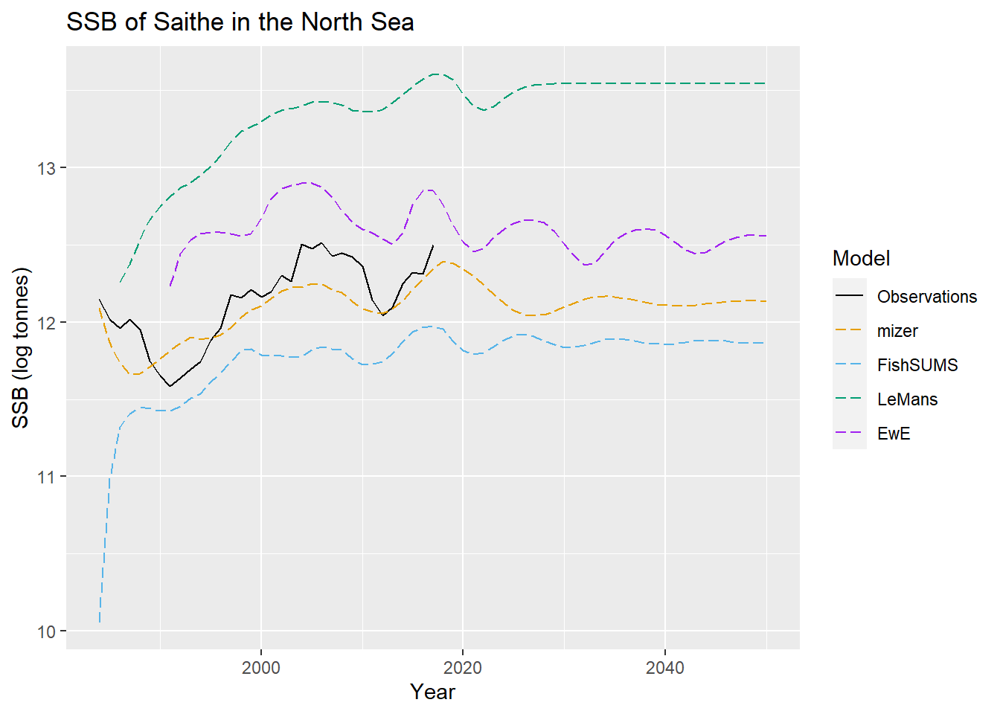
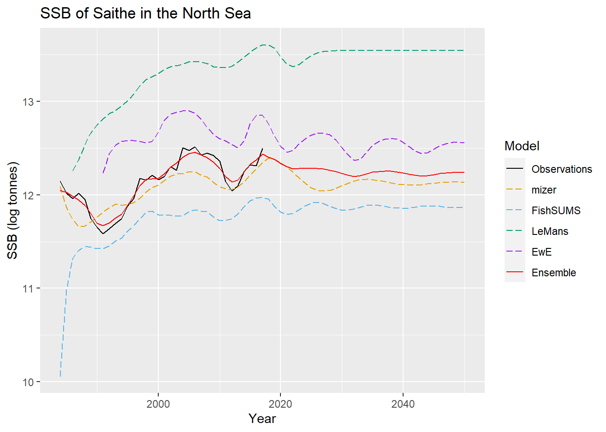
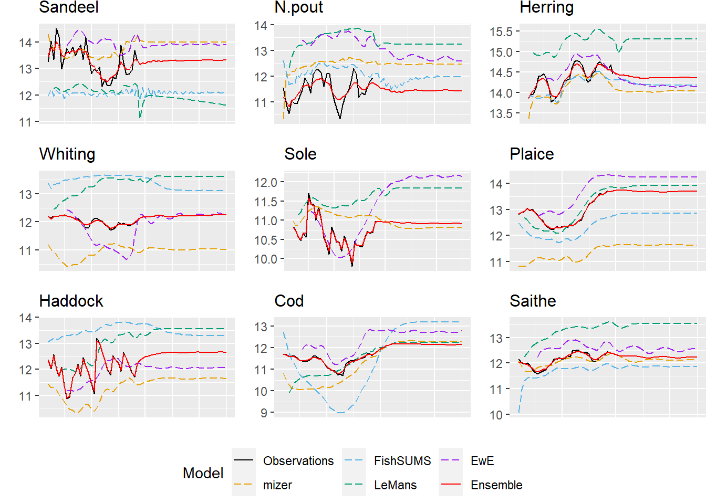

Introduction
------------

This is a worked example applying the ensemble model for combining
ecosystem models as laid out in [Spence et
al.](https://onlinelibrary.wiley.com/doi/full/10.1111/faf.12310) In this
example, we will be combining 4 different ecosystem models to make
predictions about the spawning stock biomass of 9 species in the North
Sea. We start by loading the relevant packages.

``` r
library(rstan)
library(ggplot2)
```

To use the model we need 3 pieces of information:

1.  Outputs for all the simulators and associated covariances.
2.  Observations of the quantities of interest and associated
    covariances.
3.  Priors capturing our initial beliefs about how the simulators relate
    to one another.

We will pass all this data, in an appropriate form, through to the
`ensemble_model.stan` model, which implements the ensemble and runs the
MCMC.

### Data

We load in simulator outputs and observations for the SSB of 9 different
species in the North Sea.

``` r
load("MSY_runs.Rdata")
ls()
```

    ##  [1] "Sigma_ewe" "Sigma_fs"  "Sigma_lm"  "Sigma_miz" "Sigma_obs" "SSB_ewe"  
    ##  [7] "SSB_fs"    "SSB_lm"    "SSB_miz"   "SSB_obs"

This Rdata file contains information for:

-   mizer (`SSB_miz`, `Sigma_miz`) - model was run from 1984 - 2050 for
    all 9 species.
-   FishSUMS (`SSB_fs`, `Sigma_fs`) - model was run from 1984 - 2050 for
    8 species (discluding Sole).
-   LeMans (`SSB_lm`, `Sigma_lm`) - model was run for from 1986 - 2050
    for all 9 species.
-   EwE (`SSB_ewe`, `Sigma_ewe`) - model was run from 1991 - 2050 for
    all 9 species.
-   Observations (`SSB_obs` and `Sigma_obs`) - these were available from
    1984 - 2017 for all 9 species.

The `SSB_` dataframes are the predictions of the SSB, and the `Sigma_`
matrices are the associated covariance matrices. Note that the ensemble
model can still be applied to these simulators, despite the fact the
they are run over different time periods and produce outputs for
different species. To illustrate how these simulators differ, we plot
the SSB of Saithe for each of them below.



We’re now looking to combine these models to form an ensemble. We
concatenate the various matrices ready to pass through to STAN.

``` r
model_data <- list(M = 4,# The number of models we're combining
                   N = 9,# The number of model outputs (i.e species) we're considering
                   time = 67, # The time run is 67 years, from 1984 to 2050 
                   
                   # The simulator information, concatenated into one matrix. When we
                   # have no output data, we pass through 0.
                   model_outputs = cbind(as.matrix(SSB_miz),
                                         as.matrix(SSB_fs),
                                         rbind(matrix(0,2,9),as.matrix(SSB_lm)),
                                         rbind(matrix(0,7,9),as.matrix(SSB_ewe))),
                   model_covariances = c(as.numeric(Sigma_miz),
                                         as.numeric(Sigma_fs),
                                         as.numeric(Sigma_lm),
                                         as.numeric(Sigma_ewe)),
                   
                   # The observation information. We pass through 0 for 2018:2050
                   # where we have no observations.
                   observations = rbind(as.matrix(SSB_obs),
                                        matrix(0,33,9)),
                   obs_covariances = Sigma_obs,
                   
                   # Converting from simulator outputs to a common framework. The Ms 
                   # are the matrices that convert from "best guesses" to simulator outputs.
                   # These are all the identity, except for FishSUMS, where we exclude the 
                   # column for Sole (FishSUMS produces no output for Sole).
                   model_num_species = c(9,8,9,9),
                   Ms = rbind(diag(9),     # mizer
                              diag(9)[-5,],# FishSUMS
                              diag(9),     # LeMans
                              diag(9)),    # EwE
                   
                   # Indicating whether we have observations / model outputs 
                   # for each time step.
                   observation_times = cbind(c(rep(1,34),rep(0,33)),  # Observations
                                             rep(1,67),               # mizer
                                             rep(1,67),               # FishSUMS
                                             c(rep(0,2),rep(1,65)),   # LeMans
                                             c(rep(0,7),rep(1,60)))   # EwE
)
```

Priors
------

Next, we need to decide on priors for the model. For more details on how
priors might be elicited, see the supporting information of [Spence et
al.](https://onlinelibrary.wiley.com/doi/full/10.1111/faf.12310) Recall
that discrepancies are decomposed into time-varying short-term
discrepancies *η*<sup>(*t*)</sup>, *z*<sub>*i*</sub><sup>(*t*)</sup>,
and static long-term discrepancies *δ*, *γ*<sub>*i*</sub>, so that

*μ*<sup>(*t*)</sup> = *y*<sup>(*t*)</sup> + δ + *η*<sup>(*t*)</sup>

*x*<sub>*i*</sub><sup>(*t*)</sup> = *μ*<sup>(*t*)</sup> + *γ*<sub>*i*</sub> + *z<sub>i</sub><sup>(t)</sup>*

Here, *x*<sub>*i*</sub><sup>(*t*)</sup> are the simulator best guesses,
*μ*<sup>(*t*)</sup> is the simulator consensus and *y*<sup>(*t*)</sup>
is the true SSB of the system.

### Individual Discrepancies

#### Short-term discrepancies

We assume that short term discrepancies follow a stationary *AR*(1)
process, writing So we need to elicit priors on *R*<sub>*i*</sub> and
*Λ*<sub>*i*</sub>. (Note that the above holds for *t* ≥ 1 and we should
specify the initial distribution *z*<sub>*i*</sub><sup>(0)</sup> - in
our implementation this is simply drawn from the stationary distribution
of the process).

We have no real prior beliefs about *R*<sub>*i*</sub>, so we assume
*R*<sub>*i*</sub> is a diagonal matrix with each of the elements drawn
uniformly from the range ( − 1, 1) (this restriction is needed to ensure
*R*<sub>*i*</sub> is stable). In STAN, these are the default priors for
constrained parameters, so we don’t need to specify anything. In the
model, these are the `ind_st_ar_param` values.

Meanwhile, *Λ*<sub>*i*</sub> can be decomposed into a diagonal matrix of
variances *Π*<sub>*i*</sub> and a correlation matrix *P*<sub>*i*</sub>
so that
*Λ<sub>i</sub> =  Π<sub>i</sub><sup>1/2</sup>P<sub>i</sub>Π<sub>i</sub><sup>1/2</sup>.* This
decomposition makes elicitation easier. For the correlation matrix
*P*<sub>*i*</sub>, we choose to use the *LKJ*(*η*) distribution with
*η* = 10 (this value of *η* preferentially chooses correlation matrices
with smaller off-diagonal terms i.e. small correlations). For the
variances, we use inverse gamma distributions, with parameters
*α* = 2.5, *β* = 0.25 for each simulator and each species. In our STAN
model, these values are passed through as `prior_ind_st_cor_lkj`,
`prior_ind_st_var_a` and `prior_ind_st_var_b` respectively.

#### Long-term discrepancies

For long-term discrepancies, we assume 
*γ<sub>i</sub> ~ N(0,C)*,
so we only need to set a prior on *C*. We decompose this similarly to
above, setting
*C = Σ<sub>c</sub><sup>1/2</sup>P<sub>c</sub>Σ<sub>c</sub><sup>1/2</sup>*, with
*Σ*<sub>*c*</sub> as the variance and *P*<sub>*c*</sub> the
correlations. We again choose an inverse gamma distribution for each of
the variances, again with *α* = 2.5, *β* = 0.25. For the correlations,
we expect there to be some correlations among different species, so we
do not use the LKJ distribution. Instead, we use a Beta(5, 2)
distribution on each (off-diagonal) entry in the correlation matrix. We
pass these priors through to STAN as the `prior_ind_lt_var_a`,
`prior_ind_lt_var_b`, `prior_ind_lt_cor_beta_1`,
`prior_ind_lt_cor_beta_2` values. All our individual prior parameters
are given below:

``` r
N_species <- 9
priors_individual <- list(
  # Short term
  prior_ind_st_cor_lkj = 10,
  prior_ind_st_var_a = 2.5,
  prior_ind_st_var_b = 0.25,
  # Long term
  prior_ind_lt_var_a = rep(2.5,N_species),
  prior_ind_lt_var_b = rep(0.25,N_species),
  prior_ind_lt_cor_beta_1 = matrix(5,N_species,N_species),
  prior_ind_lt_cor_beta_2 = matrix(2,N_species,N_species)
)
```

### Shared Discrepancies

For the shared discrepancies, we decompose the short-term discrepancies
as above. We again use an *LKJ*(10) distribution for the
correlations, but for variances we use an exp (2) distribution. For the
long-term discrepancies, we prescribe the standard deviation as 2. These
quantities get passed through to STAN as `prior_sha_st_cor_lkj`,
`prior_sha_st_var_exp`, `prior_sha_lt_sd` respectively.

``` r
priors_shared <- list(
  prior_sha_st_cor_lkj = 10,
  prior_sha_st_var_exp = 2,
  prior_sha_lt_sd = rep(2,N_species)
)
```

### Fitting the model

We’re now ready to run the MCMC, so we collect all the data into one
list and fit the model using STAN.

``` r
stan_data <- append(model_data, priors_individual)
stan_data <- append(stan_data, priors_shared)
```

``` r
mod <- stan_model("ensemble_model.stan")
```

We get the MLE of the ensemble model using the `optimizing` function -
this is much quicker than running a full sampling.

``` r
fit <- optimizing(mod, data=stan_data, as_vector =F ) 
```

### Results

The `latent_mean` variable gives the ensemble’s best beliefs about the
true SSB, so we extract that here.

``` r
latent_mean <- fit$par$latent_mean
```

Below we again plot the SSB of Saithe in the North Sea, now with the
latent mean of the ensemble model plotted as well.



We can also see how well the model performs for the other species. In
all cases, the ensemble outperforms any individual simulator and gives
reasonable predictions for the SSB.


